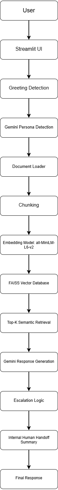

# Persona-Adaptive Customer Support Agent

## Project Overview

The Persona-Adaptive Customer Support Agent is an AI-powered customer support system that provides intelligent, context-aware responses to customer queries. The system adapts its responses based on the detected user persona and retrieves relevant information from a knowledge base to generate accurate and personalized support responses.

The application is developed using Python, Streamlit, and Google's Gemini API.

---

## Features

### 1. Persona Detection

The system uses the Gemini Large Language Model (LLM) to automatically classify users into different personas based on their queries.

Supported personas:

- Technical Expert
- Frustrated User
- Business Executive
- General User

LLM-based persona detection enables the system to understand the user's intent and communication style more accurately than rule-based classification.

---

### 2. Knowledge Base Retrieval

The system implements a vector-based Retrieval Augmented Generation (RAG) pipeline.

Workflow:

- Documents are loaded from TXT and PDF files.
- Documents are split into smaller chunks.
- Each chunk is converted into embeddings using the all-MiniLM-L6-v2 embedding model.
- Embeddings are stored in a FAISS vector database.
- User queries are converted into embeddings and semantically matched against stored document embeddings.
- The most relevant chunks are retrieved and supplied to Gemini for response generation.

Supported document formats:

- TXT
- PDF
---


### 3. Vector-Based RAG Pipeline

The application implements a semantic Retrieval Augmented Generation (RAG) architecture.

Components:

- Chunking Strategy: Fixed-size chunks with overlap.
- Embedding Model: all-MiniLM-L6-v2.
- Vector Database: FAISS.
- Retrieval Strategy: Top-K semantic similarity search.

This approach enables the system to retrieve semantically relevant information even when exact keywords are not present in the user's query.

### 4. Adaptive Response Generation

Responses are generated using the Gemini Large Language Model and adapted according to the detected user persona.

Examples:

* Technical users receive detailed technical explanations.
* Frustrated users receive empathetic responses.
* Business executives receive concise business-oriented responses.

---

### 5. Escalation Logic

The system automatically identifies situations requiring human intervention.

Examples:

* Refund requests
* Billing disputes
* Security breaches
* Unauthorized access issues
* Low retrieval confidence

---

### 6. Human Handoff Summary

When escalation is required, the system generates an internal handoff summary containing:

* User persona
* User issue
* Retrieved document
* Escalation reason
* Recommended next steps

---

### 7. Greeting Handling

The system handles greetings such as:

* Hi
* Hello
* Hey
* Good Morning
* Good Evening

without invoking the retrieval pipeline.

---

## System Architecture

```text
User
↓
Streamlit User Interface
↓
Greeting Detection
↓
Gemini Persona Detection
↓
Document Loader
↓
Document Chunking
↓
Embedding Generation (all-MiniLM-L6-v2)
↓
FAISS Vector Database
↓
Top-K Semantic Retrieval
↓
Gemini Response Generation
↓
Escalation Logic
↓
Human Handoff Summary
↓
Final Response
```


---

## Project Structure

```text
My-first-task/
│
├── docs/
│   ├── account_lock.txt
│   ├── api_authentication.txt
│   ├── billing_issue.txt
│   ├── data_export.txt
│   ├── login_troubleshooting.txt
│   ├── password_reset.txt
│   ├── refund_policy.txt
│   ├── security_policy.txt
│   ├── service_level_agreement.pdf
│   ├── subscription_upgrade.txt
│   └── system_status.txt
│
├── streamlit_app.py
├── requirements.txt
├── README.md
└── PROGRESS_LOG.md
└── architecture_diagram_renewed.png
```

---

## Technologies Used

- Python
- Streamlit
- Google Gemini API
- SentenceTransformers
- FAISS
- NumPy
- PyPDF
- HTML/CSS
- Large Language Models (LLMs)
- Retrieval Augmented Generation (RAG)

---

## Installation

```bash
git clone https://github.com/abhi-gna-115/persona-adaptive-support-agent.git
cd persona-adaptive-support-agent
```

### Create a Virtual Environment (Optional but Recommended)

```bash
python -m venv venv
```

Activate the virtual environment:

**Windows**

```bash
venv\Scripts\activate
```

**Linux/macOS**

```bash
source venv/bin/activate
```

### Install Dependencies

```bash
pip install -r requirements.txt
```
---

## Configure Gemini API Key

Replace the API key inside:

```python
streamlit_app.py
```

with your own Gemini API key.

Example:

```python
API_KEY = "YOUR_API_KEY"
```

---

## Running the Application

```bash
streamlit run streamlit_app.py
```

---

## Example Queries

### Greeting

```text
Hi
```

### Technical Query

```text
Can you explain API authentication failure and token issues?
```

### Frustrated User Query

```text
I am frustrated. I cannot reset my password.
```

### Business Query

```text
What is the business impact if system downtime exceeds SLA?
```

### Escalation Query

```text
I want a refund for duplicate charges.
```

---

## Future Improvements

* Integrate vector databases such as FAISS or ChromaDB. [done]
* Replace keyword-based retrieval with embedding-based retrieval. [done]
* Implement LLM-based persona detection. [done]
* Add user feedback collection.
* Integrate ticketing systems for automated escalation.
* Add conversation memory.

---

## Author

Developed by sai Abhinay as part of an AI Support Agent assignment.
